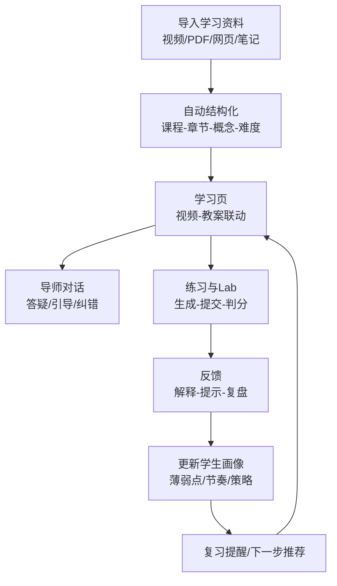

# LearnMentor 系统设计文档产品审阅与优化报告

## 执行摘要

本报告基于你提供的《LearnMentor — AI 驱动的自适应学习系统｜系统设计文档 v1.1》进行审阅与产品化细节优化建议输出。fileciteturn0file0 文档的亮点在于：愿景表达清晰（“不是工具，是导师”）、Agent 工具化与学生画像作为“持续演化认知模型”的定位具有差异化潜力、并给出了较完整的端到端技术栈与 MVP 分期路径。fileciteturn0file0

但从“产品思维 + 可落地交付”的角度，当前版本仍存在几个会显著影响落地成功率的缺口：  
其一，关键产品定义未闭环（目标用户、商业模式、北极星指标/关键 KPI、学习效果如何被衡量与证明），容易导致后续“功能堆叠但价值不收敛”。fileciteturn0file0 其二，AI 系统的“质量与安全”缺少系统化设计：包括 RAG 的可评估与可观测、导师输出的可溯源、代码沙箱与数据权限的安全基线。此类风险在 Web/在线系统里属于高优先级（例如访问控制问题被 OWASP Top 10 长期强调）。citeturn2search3turn2search0 其三，交互与信息架构仍偏工程组件视角，需要补齐用户旅程、关键任务流、可用性与无障碍规范（WCAG）对齐。citeturn3search2turn7view0

最建议你优先补齐的三件事（高影响、相对低成本）：  
第一，补一页“产品定义与成功标准”（用户是谁/不是谁、核心场景、北极星指标 + 护栏指标、阶段 KPI）。实验与指标设计可参考在线 A/B 实验关于 OEC（Overall Evaluation Criterion）与护栏指标（Guardrail metrics）的行业最佳实践。citeturn6search2turn6search0  
第二，把“导师回答可溯源/可解释”作为 MVP 必做：导师输出尽可能引用课程来源位置（视频时间戳、PDF 页码、知识库片段），并在 UI 中显式呈现，有助于降低幻觉与提升信任。RAG 的基本范式与评估也已有成熟方法可借鉴。citeturn4search0turn4search1turn4search2  
第三，建立“观测与质量闭环”：SSE 流式链路、工具调用、检索召回、成本/时延、用户反馈都要可追踪（后续才能迭代）。SSE 在 FastAPI 和浏览器端（EventSource）都有标准实现与注意事项。citeturn0search2turn0search12

---

## 文档结构与关键信息梳理

文档结构整体完整，按“理念 → 架构 → 核心模块 → 数据模型 → 项目结构 → 依赖 → MVP 计划 → 成本 → 扩展”展开，阅读路径顺畅。fileciteturn0file0 关键信息点可归纳为：

- 产品定位：强调从“学习工具”升级为“长期陪伴的 AI 导师”，并突出个性化与温度感。fileciteturn0file0  
- Agent 哲学：LLM + 工具调用 + 循环推理（观察/思考/决策/执行/反思），并列出内容提取、网络搜索、代码执行、画像 CRUD、知识库检索（RAG）等工具能力。fileciteturn0file0  
- 学生画像模型：用 Pydantic 定义 pace、学习偏好、能力域（domains 0-1）、薄弱点、学习历史、导师策略等，并提出“渐进式置信”更新机制。fileciteturn0file0  
- 技术架构：前端 Next.js App Router + React + Tailwind；后端 Python/FastAPI；异步长任务 Celery + Redis；数据层 PostgreSQL + pgvector、Redis、S3/MinIO；LLM 使用 Anthropic Claude API；前后端支持 REST/WebSocket/SSE。fileciteturn0file0  
- 核心模块：统一内容摄入（YouTube/Bilibili/PDF/MD/URL）→ LLM 结构化分析 → 知识库写入；导师 Agent Engine 支持 SSE 流式；五种交互模式（答疑/苏格拉底/主动关怀/复习/项目导师）；Docker 代码沙箱；视频嵌入与进度联动。fileciteturn0file0  
- 数据模型：用户、内容来源、课程/章节、概念与概念来源、内容块（向量）、Lab、练习、学习记录、对话历史。fileciteturn0file0  
- 里程碑：9 周 MVP 分期（基础设施→内容摄入→导师对话→Lab/习题→体验打磨）。fileciteturn0file0  

需要重点标注的“假设与未说明项”（按你要求，未给出则标注“未指定”）：

| 项目 | 文档状态 | 对落地的影响 |
|---|---|---|
| 目标用户群体 | 未指定（仅从技术栈与示例推测偏自学/开发者）fileciteturn0file0 | 需求优先级、内容策略、交互复杂度都会受影响 |
| 业务模式（付费/订阅/课程市场/企业版） | 未指定fileciteturn0file0 | 决定增长/KPI、权限体系、内容合规与成本结构 |
| 业务目标与 KPI（北极星指标、留存、学习成效） | 未指定fileciteturn0file0 | 容易“做完很多功能但不知道是否成功” |
| 合规与版权策略（视频字幕、PDF、网页抓取、二次分发） | 未指定fileciteturn0file0 | 高风险：内容摄入是核心链路之一 |
| 安全/隐私（画像数据、对话数据、最小化采集、保留周期、访问控制） | 未指定fileciteturn0file0 | 高风险：属于系统信任基础，且涉及访问控制等常见高危问题citeturn2search3turn2search0 |
| LLM 质量评估与监控（RAG 召回质量、回答可信度、成本/时延） | 未指定fileciteturn0file0 | AI 产品迭代的必备“仪表盘”，缺失会导致调不动、控不住 |
| 技术约束 | 已指定（Next.js、FastAPI、PostgreSQL/pgvector、Redis、Celery、Docker 等）fileciteturn0file0 | 有利于估算与排期，但也要求提前设计可观测/安全基线 |

---

## 目标用户、场景、业务目标与 KPI

### 目标用户与核心场景

文档未明确“目标用户是谁”，因此本报告按你的要求将其标记为“未指定”。fileciteturn0file0 不过从文档中的能力拆解（编程 Lab、Monaco Editor、代码沙箱、Agent/LLM/提示词示例）来看，你的 MVP 很可能会优先服务“有学习目标、愿意动手、需要反馈闭环”的内容型学习者（候选画像，而非确认）。fileciteturn0file0

基于现有设计，系统最核心的用户任务流可以抽象为一个“学习闭环”：

该闭环与文档提到的“内容摄入→课程生成→导师对话→Lab/习题→复习提醒/学习报告”一致。fileciteturn0file0

### 业务目标与 KPI

文档目前更偏“系统设计”，对“业务目标与 KPI”未明确。fileciteturn0file0 建议你用两层指标把方向钉住：

第一层：北极星指标（或 OEC）：定义“什么叫学习真的发生并带来价值”。在线实验方法论建议用可在短周期内计算、又能因果指向长期目标的指标，并配套护栏指标避免副作用。citeturn6search2turn6search0

第二层：体验与增长指标：可参考 HEART（Happiness/Engagement/Adoption/Retention/Task Success）框架来覆盖用户体验质量维度。citeturn3search10

结合 LearnMentor 的特点，可落地的一组候选指标（均为建议，不是文档既定）：

- 北极星/OEC（建议择一或组合）：  
  - “有效学习完成数”：用户完成的章节/知识点中，练习达到掌握阈值（例如连续 2 次正确或达到 80%+）的数量。  
  - “学习目标达成率”：用户设定目标（例如“掌握 Agent 基础”）在 2/4 周内达到里程碑的比例。  
  这类“掌握阈值”思路与 mastery learning（掌握学习）强调的“达到掌握再前进”相契合。citeturn5search6

- 护栏指标（建议）：学习疲劳/打扰指标（退订或关闭提醒、负反馈率）、成本指标（LLM 调用成本/人/周）、性能指标（SSE 断流率、P95 响应时延）。护栏指标是实验最佳实践中用来防止“主指标上涨但整体变差”的关键机制。citeturn6search0turn6search8

- 任务成功（Task Success）：  
  - 导入资料成功率（从“提交链接/文件”到“课程 ready”）  
  - “提问→得到可用答案”的成功率（用反馈按钮/二次追问率衡量）  

---

## 问题清单

下面的问题清单按严重性（高/中/低）排序；“证据”一栏主要引用你文档中的现状描述。fileciteturn0file0

| 严重性 | 问题 | 影响 | 证据/现状 |
|---|---|---|---|
| 高 | 产品定义缺口：目标用户、商业模式、成功指标、KPI 未指定 | 容易偏离价值交付；优先级难以裁决；迭代无法证明有效 | 文档未给出目标用户与 KPI，仅给系统分期与成本估算fileciteturn0file0 |
| 高 | “可信与可控”机制不足：导师输出缺少可溯源呈现、RAG 质量评估/监控未设计 | AI 导师一旦出现幻觉/错误，信任崩塌；也难以定位与改进 | 文档提到知识库/RAG 与跨来源关联，但未给评测与引用呈现方案fileciteturn0file0 |
| 高 | 安全与权限边界未定义：学生画像、对话历史、代码沙箱、网络搜索工具缺少安全基线与访问控制说明 | 可能出现越权访问、数据泄露、沙箱逃逸、提示词注入等高风险 | 文档给出 Docker 沙箱与工具集，但未定义系统级安全策略；访问控制是 OWASP Top 10 的头号风险之一citeturn2search0turn2search3 |
| 高 | 内容摄入的版权/合规边界未说明（YouTube/Bilibili/PDF/网页） | 可能导致内容下架/投诉/法律风险；阻断增长与合作 | 文档强调“任意来源摄入”，但未写许可/留存/分发策略fileciteturn0file0 |
| 中 | 学生画像“渐进式置信”虽提出但缺少可执行的数据结构：置信度、证据、版本、纠错机制 | 个性化可能“越用越偏”；用户难以纠正系统误解 | 文档描述渐进式置信逻辑，但数据模型未体现置信与证据字段fileciteturn0file0 |
| 中 | 数据模型存在可扩展性与一致性风险：大量 JSONB/数组字段、概念 name 唯一但缺少别名/同义词/多语言机制 | 概念合并困难、查询性能与数据治理复杂、国际化受限 | concepts.name UNIQUE，sections/source_ids 用数组，users.student_profile JSONBfileciteturn0file0；JSONB/索引与设计取舍需谨慎citeturn1search5turn1search13 |
| 中 | SSE/流式链路的可靠性与前端重连/错误处理未说明 | 对话体验不稳定时用户感知差；难以排障 | 文档使用 SSE 流式，但未描述 EventSource 重连、断流、幂等等细节fileciteturn0file0；SSE 事件格式与错误处理有标准约束citeturn0search2turn0search3 |
| 低 | 视频联动细节（YouTube/Bilibili）缺少参数与跨域/权限策略描述 | 进度同步不稳定；特定浏览器/场景不可用 | YouTube IFrame 控制需 enablejsapi=1 等参数citeturn2search1turn2search4；Bilibili 站外播放器有官方用法citeturn2search2 |
| 低 | 可用性/无障碍未纳入设计要求（键盘操作、可读性、状态提示） | 学习场景长时使用，细节会决定留存 | 可用性可用 Nielsen 启发式做基线检查citeturn3search2；无障碍可对齐 WCAG（已有简中授权翻译版本）citeturn7view0 |

---

## 优化建议

以下建议以“产品价值→交付可行→风险可控”为排序原则；每条均包含用户价值与风险/代价提示。

### 补齐产品定义页

建议在文档开头增加一页“产品定义（PRD One-pager）”，并作为后续所有决策的裁判标准。包含：

- 目标用户（未指定→需定义）：至少写清楚“是/不是”。示例：  
  - 是：希望系统能陪跑、强调动手与反馈闭环的自学者  
  - 不是：只想“看视频不做练习”的轻量用户（否则会被 Lab/画像成本拖累）

- 核心场景（3 个以内）：  
  1）从一组来源生成学习路径并开始学习；2）卡点答疑与纠错；3）通过练习/Lab 达到掌握并复习巩固。fileciteturn0file0  

- 北极星指标/OEC + 护栏指标：  
  在线受控实验强调 OEC 的“短期可测 + 指向长期目标”，并用护栏指标防止副作用（例如主指标变好但投诉/流失上升）。citeturn6search2turn6search0

用户价值：团队/个人在迭代时不会被“灵感驱动”带偏；把“导师的温度”落成可度量的体验目标。  
风险：需要你先做少量用户调研/自用验证；但这是低成本高收益。

### 把“可信输出”产品化：引用、证据与可纠错

文档已有“概念节点关联多个来源”的设想，这是很强的信任抓手。fileciteturn0file0 建议把它做成产品能力，而不是仅存在于后台数据结构：

- 导师回答默认提供“依据卡片”（可折叠）：展示引用来源（视频时间戳、PDF 页码、网页段落）+ 为什么相关。  
- 答案中对关键结论加“置信提示/适用范围”：当检索证据不足时明确“不确定/建议你看这一段来源”。  
- 增加“纠错入口”：用户可标记“这段不对/不适用”，并选择原因（过时/理解偏差/与资料不一致/引用错位）。

用户价值：显著降低 AI 导师的信任门槛，减少“看似很懂但其实编造”的风险；也便于用户复盘与学习。RAG 的基本思想就是把生成建立在外部检索之上，形成“非参数记忆 + 参数模型”的结合。citeturn4search0  
风险：需要做 UI 信息密度控制，否则会“像搜索结果页”；建议默认折叠，仅在关键结论处露出 1-2 条最强依据。

### 让 RAG 与 Agent 进入“可评估、可监控”的工程闭环

你文档里把知识库/RAG 作为核心工具，但没有定义“好/坏怎么量”。fileciteturn0file0 建议引入组件级评估与线上监控两条线：

- 离线评估：抽样构造“问题-参考答案-参考来源”集，对检索与生成分别评估（每周/每版本跑一次）。  
- 指标选择：可参考 RAGAS 的组件化指标集合，如 Faithfulness、Answer relevancy、Context recall/precision 等，用于分别衡量生成是否忠实于上下文、答案是否相关、检索上下文是否覆盖关键证据。citeturn4search1  
- 线上监控：对每次对话记录（脱敏后）检索命中率、引用点击率、用户反馈、二次追问率；同时记录每次 tool 调用的成功率与耗时。

用户价值：RAG/Agent 类产品最难的是“坏了你不知道为什么”，评估与监控是持续迭代的地基。LangChain/LlamaIndex 等生态也强调“先定义端到端评估工作流，再逐步定位失败模式”。citeturn4search2turn4search6  
风险：需要建立评估数据采集与标注成本；建议先从“自用+小样本”开始。

### 学生画像的数据治理：置信度、证据、用户可控

文档的学生画像设计非常完整，但目前更像“理想模型”，缺少面向产品的治理与可控性：fileciteturn0file0

建议在画像结构中补三类字段（不要求一次做完，但要在设计上预留）：

1) 置信度与证据：  
- 每个关键推断（例如 pace、weak_spots、domains）附带 confidence 分数、证据来源（对话 id、练习记录 id）与最近更新时间。  
- 这能把你提出的“渐进式置信”从文字落到数据结构。fileciteturn0file0  

2) 用户可编辑与回滚：  
- UI 提供“导师对我的理解”页面，允许用户确认/否认系统推断，并可一键重置某类推断（例如“清空薄弱点规则”）。  

3) 数据最小化与保留策略（文档未指定，需补）：  
- 明确哪些数据必须存（学习记录、概念掌握度），哪些数据可选（情绪推断、原始对话全文）。  
- 提供导出/删除入口（至少在设计层面描述）。

用户价值：个性化的前提是“被正确理解且可纠正”；否则个性化会变成“系统的偏见”。  
风险：需要更多产品与工程工作，但建议先做“可解释 + 可纠错”最小闭环。

### 交互与信息架构优化：把模式切换做成“显式、可控、可预期”

你定义了 5 种交互模式，但触发规则与 UI 呈现未明确。fileciteturn0file0 从产品体验来看，隐式切换很容易引发“导师突然变严厉/突然开始反问”的不适。

建议：

- 在对话区顶部显示当前模式（例如：答疑 / 引导 / 复习），并允许用户一键切换或“锁定本次模式”。  
- 每次模式切换给出一句原因（可折叠）：例如“你在这道题连续错了 2 次，我用苏格拉底模式带你定位误区”。  
- 给“主动关怀/复习提醒”提供强控制：频率、时段、关闭入口（否则容易造成打扰，影响留存）。

用户价值：符合可用性原则中的“系统状态可见”“用户可控”。citeturn3search2  
风险：需要 UI 位置与信息密度取舍；可先做“显示当前模式 + 手动切换”，触发解释后置迭代。

示例文案（对用户更有解释性、也更克制）：
- 模式提示：  
  - “当前：引导模式（我会通过提问带你自己推导答案）”  
- 主动关怀：  
  - “我看到你这两天没继续学，要不要我帮你把下一节拆成 15 分钟的小任务？”

### 学习科学细节落地：复习提醒从“艾宾浩斯”升级为“可验证效果的间隔复习”

文档计划做“复习提醒（艾宾浩斯遗忘曲线）”。fileciteturn0file0 但在产品落地时，建议把它变成“可测指标驱动”的功能，而不是只做定时提醒：

- 遗忘曲线本身在后续研究中被讨论与复现；可把它当启发，但更建议用学习记录数据动态校准复习间隔。citeturn5search1  
- 间隔复习（spaced repetition/spacing effect）在多类研究中被证实能提升长期记忆保持；你可以用它支撑“为什么要复习提醒”的产品叙事与实验设计。citeturn5search16turn5search0  
- 复习提醒的推荐逻辑建议基于“掌握度下降风险”：概念掌握度（由练习正确率、最近一次接触时间、错误类型）计算，而不是“统一 1/3/7 天”。

用户价值：真正提升学习结果，并能用数据证明“导师让你学得更牢”。  
风险：需要掌握度模型（可先从简单规则做起）。

### 数据模型与存储：减少未来返工的几个关键点

现有模型能跑 MVP，但有一些结构会给后期迭代带来高昂的数据迁移/查询成本。fileciteturn0file0 建议优先改：

- JSONB 使用策略：  
  PostgreSQL 的 json 与 jsonb 在存储与查询效率上差异明显，jsonb 支持索引并更适合绝大多数应用，但仍应避免把“高频查询字段”全部塞进大 JSON 里。citeturn1search5turn1search13  
  建议：StudentProfile 可拆出关键字段（例如 pace、语言、学习目标）做结构化列，其余作为 jsonb 扩展字段；并为关键路径增加索引。

- 嵌入向量维度一致性：  
  你在 concepts/content_chunks 里使用 vector(1536)，这与 OpenAI 的 text-embedding-3-small 默认 1536 维是一致的（是正确选择）。citeturn1search2  
  建议补一条“schema 约束与迁移策略”：一旦换 embedding 模型/维度，如何双写、如何回填、如何灰度。

- 向量索引：  
  pgvector 支持 HNSW 与 IVFFlat 等索引；HNSW 通常提供更好的速度-召回权衡但会占用更多内存并增加构建成本。citeturn1search0turn1search16  
  建议在设计文档中补“何时建索引、索引参数如何选、如何做在线重建（concurrently）”的运维策略说明。

- 概念同义词/别名机制：  
  concepts.name UNIQUE 会在“同义词、缩写、多语言”场景下很快遇到瓶颈。建议增加 concept_aliases 表（alias、language、type），并把概念“规范名”与“显示名”区分。

用户价值：减少后期性能与数据治理返工，提高检索与学习路径推荐的稳定性。  
风险：需要做一次数据迁移设计，但越早越便宜。

### 流式对话与前端体验：SSE 可靠性与状态提示做扎实

文档采用 SSE 流式输出，这是 AI 对话非常常见且体验友好的方案。fileciteturn0file0 SSE 的事件格式、字段（data/event/id/retry）及浏览器端 EventSource 行为（重连、错误处理）都有清晰标准实现。citeturn0search2turn0search3turn0search12

建议补齐三类工程+产品细节：

- 前端状态可见：显示“正在思考/正在检索/正在运行代码/正在生成练习”，对应 Agent 工具调用阶段（符合“系统状态可见”）。citeturn3search2  
- 断流重连：EventSource 断线后自动重连，但你需要设计幂等与消息序号（id），避免重复写入对话历史。citeturn0search3turn0search12  
- 超时与降级：当工具调用或模型超时，给出可执行的降级选项（例如“改为只用课程内容回答/改为只返回引用资料/稍后再试”）。

用户价值：减少“卡住”的挫败感，提高连续使用意愿。  
风险：需要在后端引入 request_id/trace_id，前端配合事件类型渲染。

### 视频联动：把“能播”升级为“可控、可同步、可解释”

你在代码示例里已经使用 YouTube embed + enablejsapi=1，这是与 IFrame Player API 联动的关键条件。citeturn2search1turn2search4 Bilibili 站外播放器也有官方 iframe 用法。citeturn2search2

建议补齐以下产品化细节：

- 进度联动的“解释层”：右侧教案滚动时高亮当前知识点，并提供“为什么跳到这里”（对应视频时间片段/概念节点）。  
- 用户控制：允许关闭自动滚动/改为“轻提示”（避免用户阅读被打断）。  
- 兼容性策略：不同平台/浏览器对 iframe 的限制不同，建议写清楚“最低可用”与降级策略。

---

## 优先级与实施计划

以下计划按“影响力/成本”综合排序，并按你要求标注优先级（高/中/低）、任务、验收标准与估算（以单人/小团队人日为单位；若涉及外部工具/数据平台且文档未指定，则标注“无特定约束”）。fileciteturn0file0

| 优先级 | 迭代项 | 具体可执行任务 | 验收标准（示例） | 估算 | 用户价值与风险 |
|---|---|---|---|---|---|
| 高 | 产品定义页补齐 | 在文档开头新增：目标用户、核心场景、北极星指标/OEC+护栏、阶段 KPI；并与 MVP phase 对齐 | 评审时可以用该页回答“为什么做/不做某功能” | 0.5–1 人日 | 价值：统一方向；风险：需要少量调研/自用验证citeturn6search2turn6search0 |
| 高 | 导师回答可溯源（引用卡片） | 设计引用数据结构（source_id + 位置）；UI 增加“依据”折叠卡；导师输出按模板生成引用 | 80%+ 回答包含至少 1 条可点击引用；引用点击可回到对应视频时间/页码 | 3–6 人日 | 价值：显著提升信任并降低幻觉风险；风险：UI 信息密度增大，需要折叠与排序 |
| 高 | 观测性与埋点基线 | 定义 trace_id；记录：tool 调用耗时/失败、检索命中、token/成本、SSE 断流；建立最小仪表盘（无特定约束，可先写入 Postgres） | 能按一次对话追踪完整链路；能看到 P95 时延与错误率 | 4–8 人日 | 价值：AI 系统可持续迭代的地基；风险：需要规范数据采集与脱敏 |
| 高 | 沙箱安全基线 | 在 Docker 沙箱上补：资源限制策略、非 root、只读 FS、禁网、超时；记录执行日志与异常 | 任意用户代码无法联网；超时/内存溢出可控；异常可追踪 | 5–10 人日 | 价值：降低高风险事故；风险：工程复杂、需持续维护；Docker 资源限制有明确机制citeturn2search9turn2search3 |
| 中 | 学生画像治理（置信/证据/可纠错） | 为画像字段增加 confidence 与 evidence；新增“导师对我的理解”页面：确认/否认/重置 | 用户可一键纠正；纠正后推荐与解释策略有可见变化 | 5–8 人日 | 价值：个性化更可靠；风险：需要设计交互，避免打扰 |
| 中 | RAG 评估基线 | 构建小型评测集；接入 RAGAS 指标（faithfulness、answer relevancy、context recall/precision）；每周跑一次 | 每版能输出趋势图；可定位“检索差/生成差” | 4–8 人日 | 价值：质量可量化；风险：标注成本；RAG 评估指标体系已有成熟参考citeturn4search1turn4search2 |
| 中 | 概念同义词/多语言扩展 | 增加 concept_aliases；写入与检索时做 alias 归一；前端展示规范名+别名 | 同一概念不同叫法能命中同节点；不会因 name UNIQUE 卡死 | 3–6 人日 | 价值：知识库能力更稳；风险：需要迁移与回填 |
| 中 | 模式切换显式化 | 对话 UI 顶部展示当前模式；提供手动切换；模式变化给出原因提示 | 用户可一键切换；负反馈率下降 | 2–4 人日 | 价值：减少“导师反常”不适；风险：需要解释文案与边界 |
| 低 | 无障碍与可用性基线 | 关键页面键盘可达；对比度/字号；状态提示；表单错误提示 | 主要流程无需鼠标也可完成；读屏信息完整 | 3–6 人日 | 价值：长时学习体验更好；风险：需要前端细致打磨；可对齐 WCAG 2.1 简中授权译本citeturn7view0turn3search2 |
| 低 | YouTube/Bilibili 联动健壮性 | 补齐 iframe 参数与错误处理；埋点记录“进度同步失败” | 同步成功率达标；失败可降级为手动定位 | 2–4 人日 | 价值：减少联动故障；风险：平台差异；YouTube/Bilibili 均有明确嵌入要求citeturn2search1turn2search2 |

---

## 测试与监测方案

### A/B 测试设计建议

鉴于文档未指定商业目标与 KPI，建议先围绕“学习效果 + 留存 + 信任”做最小实验集；每个实验都要有主指标与护栏指标，避免“更 push 导致短期活跃升但长期流失”。在线实验最佳实践强调：指标需要短期可测、可计算、足够敏感，并尽量用 OEC 承载长期目标；护栏指标用于监控副作用。citeturn6search2turn6search0 同时，平台级也要监控 SRM（Sample Ratio Mismatch）等会使实验失真的问题。citeturn6search8

建议的实验包（每个都配套衡量与护栏）：

- 实验一：导师回答“带引用卡片” vs “不带引用”  
  - 主指标：回答有用率（👍/👎）、二次追问率下降、引用点击率  
  - 护栏：单次对话时延、内容阅读中断率  
  - 目的：验证“可溯源”是否提升信任与效率（通常对 RAG 产品很关键）。citeturn4search0turn4search1  

- 实验二：主动关怀 push_level（gentle vs moderate）  
  - 主指标：次日/7日回访率、学习连续天数  
  - 护栏：关闭提醒比例、投诉/负反馈、退订率  
  - 目的：找到“推动”与“打扰”之间的平衡点。护栏指标用于防止副作用是标准做法。citeturn6search0turn6search12  

- 实验三：练习提示策略（分级 hint vs 直接给答案）  
  - 主指标：练习完成率、掌握度提升（同概念后续正确率）  
  - 护栏：单题耗时过长导致放弃率  
  - 目的：验证“引导式”是否更有长期学习收益（与交互模式设计一致）。fileciteturn0file0  

### 线上监测与告警建议

围绕你系统的关键链路（内容摄入、RAG、导师对话、代码沙箱、学习记录），建议建立最低限度的监测面板：

- 可靠性与性能  
  - SSE：连接成功率、平均持续时长、断流率、重连次数（SSE 标准与 EventSource 行为可参考规范与实现文档）。citeturn0search2turn0search12  
  - API：P50/P95 时延、5xx/4xx、队列堆积（Celery+Redis 场景建议关注 broker 负载；Redis 作为 broker/backend 的特性与注意事项在 Celery 文档中有说明）。citeturn1search3turn1search7  

- 质量  
  - RAG：context recall/precision、faithfulness、answer relevancy（离线定期）；线上用“引用点击率 + 负反馈样本抽检”做近似监控。citeturn4search1turn4search2  
  - 导师：用户反馈、二次追问率、会话完成率

- 成本  
  - LLM 调用次数、tokens、每有效学习完成成本（把成本绑定到北极星指标，避免“省钱导致体验崩”）

- 安全  
  - 关键操作审计：课程/来源的创建与访问、沙箱执行记录、异常与限流（访问控制风险属于行业高频高危类别）。citeturn2search0turn2search3  
  - Docker 沙箱资源：CPU/内存/超时触发次数；Docker 对容器资源限制有明确机制说明，可据此设置并监控。citeturn2search9  

### 替代方案建议

当你在实现中遇到成本/复杂度瓶颈，可考虑以下替代方案（用于降低风险或加速验证）：

- 若知识图谱实现复杂：先做“概念标签 + RAG”最小闭环，图谱可视化后置；先用评估指标证明 RAG 提升学习效果，再投入图谱交互。RAG 的价值在于把生成建立在外部证据上。citeturn4search0turn4search1  
- 若 SSE 前端集成成本高：可短期用请求轮询获取增量（体验差但可验证），中期再切 SSE；SSE 本身在 FastAPI 与浏览器端都有标准实现路径。citeturn0search2turn0search3  
- 若 OpenAI embedding 成本或依赖不理想：可先用本地 embedding（文档也提到 sentence-transformers）作为替代，待验证价值后再切换；但切换时要注意向量维度、回填与灰度策略。citeturn1search2turn0file0  

以上方案的共同目标是：先把“学习闭环 + 信任闭环 + 可观测闭环”跑起来，再逐步提高智能与体验上限。fileciteturn0file0